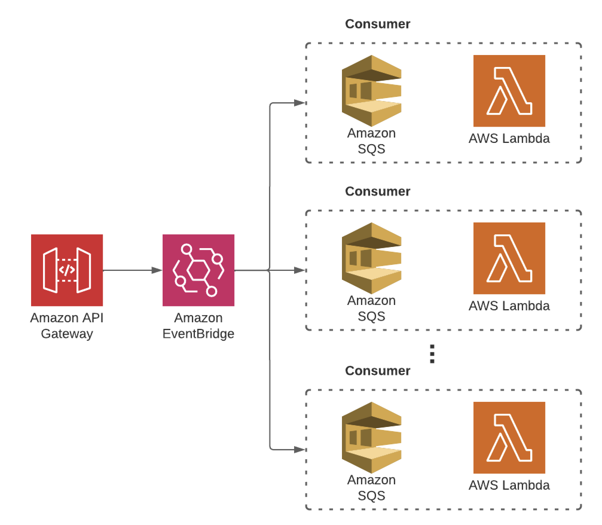

# The Big Fan



This is an example cdk stack to deploy "The Big Fan" from Heitor Lessa as seen in these [re:Invent slides](https://d1.awsstatic.com/events/reinvent/2019/REPEAT_3_Serverless_architectural_patterns_and_best_practices_ARC307-R3.pdf) or this [Youtube Recording](https://www.youtube.com/watch?v=9IYpGTS7Jy0) from [Heitor Lessa](https://twitter.com/heitor_lessa).

In this example we have a `POST /whitdrawl` endpoint that takes a POST request with a JSON payload you can inspect in the [schema](schema/openapi.yaml) file.

When API Gateway receives the json it automatically through VTL routes it to an EventBridge event bus, which has three set of rules:

1. **Send everything**: This rule sends all events to its targets.
2. **Send credit**: This rule sends all events which paymentType is `'credit'`.
3. **Send debit**: This rule sends all events which paymentType is `'debit'`.

The target of the **Send everything** rule is a CloudWatch LogGroup, in order to see all logs, even those that won't be catched by the other two.

The targets of the **Send credit** and **Send debit** rules are SQS queues, which also are the event sources of a lambda function respectively. Therefore, there's a lambda function to process all whitdrawls made using a credit card, and there's another lambda function to specifically process all whitdrawls made using a debit card.

Each lambda function also has its own CloudWatch LogGroup, where we will be able to observe the incoming events to each one.

### Payload typing

```typescript
interface Payload {
  transactions: {
    paymentType: 'credit' | 'debit';
    amount: number;
  }[];
}
```

## Schema

To see the schema for the API Gateway you can use [Swagger Editor](https://editor.swagger.io)

You can use the one provided from the [schema file](schema/openapi.yaml) in this project.

## How to Deploy

To deploy the stack in this project you can execute the following in the terminal:

```bash
#1.
cdk bootstrap # Run only if CDK is not bootstrapped in the AWS account

#2.
npm install # Install dependencies

#3.
cdk synth # Synthetize stack

#4.
cdk deploy # Deploy stack
```

## Useful commands

* `npm install`     install project dependencies
* `npm run build`   compile typescript to js
* `npm run watch`   watch for changes and compile
* `npm run test`    perform the jest unit tests
* `cdk bootstrap`   provisions resources CDK needs before deploying
* `cdk deploy`      deploy this stack to your default AWS account/region
* `cdk diff`        compare deployed stack with current state
* `cdk synth`       emits the synthesized CloudFormation template
